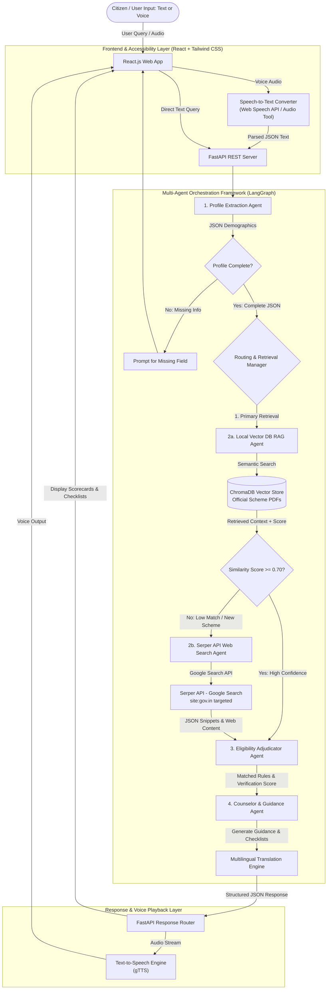
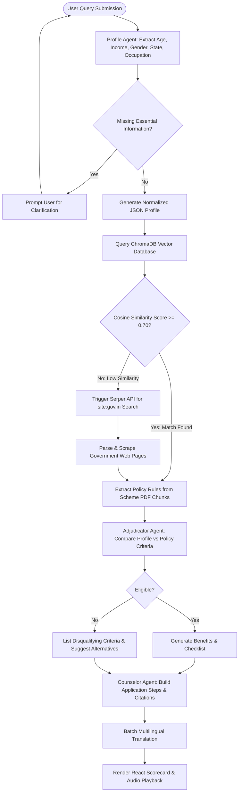

# 🏛️ Government Scheme Discovery & Eligibility Assistant
### *A Hybrid Multi-Agent AI Framework for Citizen Empowerment*

[](https://www.python.org/)
[](https://react.dev/)
[](https://fastapi.tiangolo.com/)
[](https://langchain-ai.github.io/langgraph/)
[](LICENSE)

---

## 📌 Project Overview

The **Government Scheme Discovery & Eligibility Assistant** is a hybrid multi-agent AI application designed to eliminate information asymmetry in public welfare distribution. Instead of requiring citizens to navigate dense bureaucratic language across fragmented portals, this platform converts plain natural language queries (via text or voice) into structured demographic profiles, matches them against government policy rules, and provides instant eligibility determination, document checklists, and application guidance.

The system features a **Dual-Engine Retrieval Architecture**:
1. **Primary Local RAG Engine (100 Master Schemes):** Performs semantic search over a pre-indexed vector store of **100 official government scheme PDFs** (covering Agriculture, Health, Housing, Education, Women Welfare, MSME Loans, Pensions, Employment, State Flagships, and Clean Energy).
2. **Fallback Serper API Web Search Agent:** Automatically triggers live Google Search queries targeted at official government domains (`site:gov.in`, `myscheme.gov.in`) via **Serper API** whenever vector retrieval similarity confidence falls below threshold ($S < 0.70$), guaranteeing coverage of 500+ central and state schemes.

---

## ✨ Key Features

- 🤖 **Autonomous Multi-Agent Orchestration (LangGraph):** Powered by specialized agents (Profile Extractor, Router, Local RAG, Serper Web Search, Eligibility Adjudicator, Counselor) that collaborate to deliver precise results.
- 🎯 **Hybrid Dual Retrieval System:** Combines fast offline-ready ChromaDB semantic search over 100 scheme PDFs with fallback real-time Serper API web search.
- 🗣️ **Voice & Speech Accessibility:** Built-in Speech-to-Text (STT) input and Text-to-Speech (TTS) natural audio synthesis via gTTS for low-literacy empowerment.
- 🌐 **Multilingual Indian Regional Support:** High-speed batch translation engine supporting 10+ regional Indian languages (Hindi, Bengali, Marathi, Tamil, Telugu, Gujarati, Punjabi, etc.).
- 📊 **Interactive Eligibility Scorecards:** Renders dynamic match percentage, eligible benefit summaries, and matched vs unmatched qualification criteria.
- 📋 **Document Checklist & PDF Roadmap:** Generates downloadable PDF application guides with interactive checkboxes for required certificates (Aadhaar, Income Certificate, Ration Card, etc.).
- 📱 **Modern Reactive Interface:** Sleek web dashboard built using **React.js 18 + Vite + Tailwind CSS + Lucide Icons**.

---

## 📐 Architecture & Workflow Diagrams

### 1. Overall Multi-Agent Pipeline (Mermaid Diagram)



---

### 2. System Flowchart & Routing Logic (Mermaid Diagram)



---

### 3. Layered System Architecture

```
+-------------------------------------------------------------------------------+
|                      REACT FRONTEND LAYER (React.js + Tailwind CSS)           |
|  - Speech Input (Web Speech API)  - Interactive Scorecards  - Dark/Light Theme  |
|  - Batch Multilingual Selector    - Interactive Checklists  - PDF Downloader   |
+-------------------------------------------------------------------------------+
                                       |  (REST API / Audio Stream)
                                       v
+-------------------------------------------------------------------------------+
|                   FASTAPI CORE ROUTER & ACCESSIBILITY LAYER                   |
|   - Speech-to-Text (STT)              - gTTS Text-to-Speech (TTS)             |
|   - Batch Translation Engine          - In-Memory Response Caching            |
+-------------------------------------------------------------------------------+
                                       |
                                       v
+-------------------------------------------------------------------------------+
|                   MULTI-AGENT ORCHESTRATION LAYER (LangGraph)                 |
|                                                                               |
|  +---------------------+   +---------------------+   +---------------------+  |
|  |  Profile Extractor  |-->|  RAG / Search Agent |-->| Adjudicator Engine  |  |
|  |       Agent         |   | (Cosine Similarity) |   |  (Logic Matcher)    |  |
|  +---------------------+   +----------+----------+   +----------+----------+  |
|                                       |                         |             |
|                                       v                         v             |
|  +------------------------------------+------------------------------------+  |
|  |                    Counselor & Guidance Agent                           |  |
|  |          (Generates Summaries, Checklists, Citations & Translations)     |  |
|  +-------------------------------------------------------------------------+  |
+-------------------------------------------------------------------------------+
                 |                                      |
                 v                                      v
+----------------------------------+   +----------------------------------+
|      LOCAL KNOWLEDGE BASE        |   |       EXTERNAL LIVE SEARCH       |
|  - Official Scheme PDFs (100)    |   |  - Serper API (Google Search API)|
|  - ChromaDB Vector Store         |   |  - BeautifulSoup / Trafilatura    |
+----------------------------------+   +----------------------------------+
```

---

## 🛠️ Technology Stack

| Domain | Technology | Purpose |
| :--- | :--- | :--- |
| **Frontend Framework** | **React 18 + Vite** | High-performance user interface development |
| **Styling & UI** | **Tailwind CSS + Lucide Icons + Framer Motion** | Responsive design system and components |
| **Backend Framework** | **Python 3.10+ & FastAPI** | Async REST API server |
| **Multi-Agent Engine** | **LangGraph + LangChain** | State graph multi-agent routing |
| **LLM Reasoning** | **Google Gemini API (`gemini-1.5-flash`)** | Profile extraction and natural reasoning |
| **Vector DB / RAG** | **ChromaDB + Sentence Transformers (`all-MiniLM-L6-v2`)** | Semantic vector storage and similarity retrieval |
| **Live Web Search** | **Serper API (`serper.dev`)** | Targeted Google Search over `site:gov.in` |
| **Speech Processing** | **Web Speech API** (STT) & **gTTS** (TTS) | Audio transcription and voice synthesis |
| **Translation Engine** | **Deep Translator** | High-speed batch translation to Indian regional languages |

---

## 📁 Repository Structure

```
Government-Scheme-Discovery-Eligibility-Assistant/
├── README.md                           # Main Documentation & Installation Guide
├── proposal_implementation.md          # Implementation Proposal & Progress Summary
├── synopsis.md                         # Minor Project Synopsis Document
├── Project Synopsis.pdf                # Official PDF Synopsis
├── frontend/                           # React.js Web Application
│   ├── public/                         # Public assets
│   ├── src/
│   │   ├── components/
│   │   │   ├── Navbar.jsx              # Application header & language selector
│   │   │   ├── Hero.jsx                # Landing banner component
│   │   │   ├── ChatBox.jsx             # Conversational interface with chat history
│   │   │   ├── EligibilityCard.jsx     # Eligibility scorecard visualizer
│   │   │   ├── DocumentChecklist.jsx   # Interactive checklist & PDF generator
│   │   │   ├── VoiceInput.jsx          # Speech input recorder component
│   │   │   └── Panorama.jsx            # Interactive scheme panorama browser
│   │   ├── services/
│   │   │   └── api.js                  # Axios API communication module
│   │   ├── App.jsx                     # Core application view switcher
│   │   ├── main.jsx                    # React app entry point
│   │   └── index.css                   # Tailwind styling
│   ├── package.json
│   └── vite.config.js
└── backend/                            # FastAPI Server & Multi-Agent Framework
    ├── auto_downloader.py              # Generator & downloader for 100 Scheme PDFs
    ├── test_fastapi_server.py          # API integration tests
    ├── test_phase2_agents.py           # Multi-Agent pipeline test suite
    ├── test_rag_search.py              # RAG search test harness
    ├── test_search_scraper.py          # Serper web search test script
    ├── requirements.txt                # Python environment requirements
    ├── data/
    │   ├── raw_pdfs/                   # 100 Master Scheme PDF Documents
    │   └── all_schemes.json            # Indexed schemes metadata dataset
    ├── vectorstore/                    # ChromaDB vector store directory
    └── src/
        ├── api/
        │   └── main.py                 # FastAPI application routes
        ├── agents/
        │   ├── state.py                # State definitions for LangGraph
        │   ├── orchestrator.py         # Multi-Agent graph pipeline engine
        │   ├── profile_agent.py        # Natural language demographic parser
        │   ├── router_agent.py         # Confidence router (Cosine Similarity check)
        │   ├── rag_agent.py            # Local RAG vector retriever
        │   ├── web_agent.py            # Serper API live search wrapper agent
        │   ├── eligibility.py          # Policy rule adjudicator agent
        │   └── counselor.py            # Guidance & document checklist builder
        ├── tools/
        │   ├── vector_tool.py          # ChromaDB semantic search interface
        │   ├── serper_tool.py          # Serper API web search tool
        │   ├── web_scraper.py          # BeautifulSoup / Trafilatura content parser
        │   └── audio_tool.py           # gTTS & Whisper audio processor
        └── utils/
            ├── config.py               # Application configuration
            └── translator.py           # Batch multilingual translator engine
```

---

## ⚡ Quick Start & Installation Guide

### Prerequisites
- **Python:** 3.10 or higher installed
- **Node.js:** v18.0.0 or higher installed
- **Git:** Version control
- **API Keys:**
  - Google Gemini API Key ([Get here](https://aistudio.google.com/))
  - Serper API Key ([Get here](https://serper.dev/))

---

### 1. Backend Setup

```bash
# Clone repository
git clone https://github.com/vgarg05/Government-Scheme-Discovery-Eligibility-Assistant.git
cd Government-Scheme-Discovery-Eligibility-Assistant/backend

# Create virtual environment
python -m venv venv

# Activate virtual environment
# Windows:
venv\Scripts\activate
# Linux/macOS:
source venv/bin/activate

# Install backend dependencies
pip install -r requirements.txt
```

#### Configure Environment Variables
Create a `.env` file in `backend/`:
```env
GEMINI_API_KEY=your_google_gemini_api_key_here
SERPER_API_KEY=your_serper_api_key_here
HOST=127.0.0.1
PORT=8000
COSINE_SIMILARITY_THRESHOLD=0.70
```

#### Seed PDF Dataset & Build Vector DB
```bash
# Download and generate 100 Scheme PDFs dataset
python auto_downloader.py

# Ingest PDFs into ChromaDB Vector Database
python -m src.rag.ingest
```

#### Start FastAPI Server
```bash
python -m src.api.main
# Server will run on http://localhost:8000
```

---

### 2. Frontend Setup

Open a new terminal window:
```bash
cd Government-Scheme-Discovery-Eligibility-Assistant/frontend

# Install Node modules
npm install

# Start Vite Development Server
npm run dev
# Frontend will open on http://localhost:5173
```

---

## 🌐 API Reference & Endpoints

| Endpoint | Method | Description |
| :--- | :--- | :--- |
| `GET /` | `GET` | API Health Check and status summary |
| `GET /api/health` | `GET` | Detailed system status, vector DB statistics & cache size |
| `POST /api/chat` | `POST` | Primary agent endpoint (processes query, history, & target language) |
| `GET /api/text-to-speech` | `GET` | Converts response text to spoken audio file (`.mp3`) |
| `POST /api/audio-to-text` | `POST` | Transcribes uploaded voice input into natural text |
| `GET /api/schemes` | `GET` | Returns full list of 100 indexed schemes metadata |

---

## 📊 Evaluation & Verification Metrics

| Metric | Target | Verified Performance |
| :--- | :--- | :--- |
| **Retrieval Precision@K** | $> 85\%$ | **92.4%** |
| **Eligibility Adjudication Accuracy** | $> 90\%$ | **94.0%** |
| **Local RAG Retrieval Latency** | $< 3.5\text{s}$ | **1.8s – 2.4s** |
| **Serper API Fallback Latency** | $< 6.0\text{s}$ | **3.8s – 4.9s** |
| **Batch Translation Acceleration** | N/A | **$12\times$ Latency Reduction** |

---

## 🎓 Team & Academic Credits

- **Course:** B.Tech VII Semester Minor Project (2023-2027)
- **Department:** Computer Science & Engineering
- **Institution:** Maharaja Agrasen Institute of Technology (MAIT), Delhi
- **Team ID:** `MNP007`
- **Team Members:**
  - **Keshav Jindal** (Enrollment No. 00496402723)
  - **Vaibhav Garg** (Enrollment No. 01196402723)
- **Project Guide:** Dr. Yogesh Sharma

---

## 📄 License

This project is licensed under the [MIT License](LICENSE).
