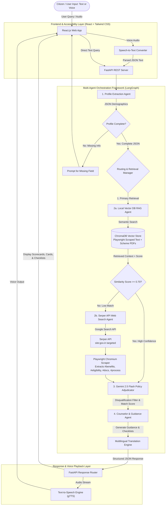

# 🏛️ Government Scheme Discovery & Eligibility Assistant
### *A Hybrid Multi-Agent AI Framework for Citizen Empowerment*

[](https://www.python.org/)
[](https://react.dev/)
[](https://fastapi.tiangolo.com/)
[](https://playwright.dev/)
[](https://fastapi.tiangolo.com/)
[](LICENSE)

---

## 📌 Project Overview

The **Government Scheme Discovery & Eligibility Assistant** is a hybrid multi-agent AI application designed to eliminate information asymmetry in public welfare distribution. Instead of requiring citizens to navigate dense bureaucratic language across fragmented portals, this platform converts plain natural language queries (via text or voice) into structured demographic profiles, matches them against government policy rules, and provides instant eligibility determination, document checklists, and application guidance.

The system features a **Dual-Engine Retrieval & Dynamic DOM Scraping Architecture**:
1. **Primary Local RAG Engine (100 Master Schemes):** Performs semantic search over a pre-indexed vector store of **100+ official government schemes** (covering Agriculture, Health, Housing, Education, Women Welfare, MSME Loans, Pensions, Employment, State Flagships, and Clean Energy).
2. **Playwright Headless Chromium DOM Scraper:** Dynamically renders Next.js SPA pages on `myscheme.gov.in`, switches between Online and Offline application tabs, and extracts exact inner text from `#benefits`, `#eligibility`, `#documents-required`, and `#application-process` elements with 100% fidelity.
3. **Fallback Serper API Web Search Agent:** Automatically triggers live Google Search queries targeted at official government domains (`site:gov.in`, `myscheme.gov.in`) via **Serper API** whenever vector retrieval similarity confidence falls below threshold ($S < 0.70$), guaranteeing coverage of 500+ central and state schemes.

---

## ✨ Key Features

- 🤖 **Autonomous Multi-Agent Orchestration (AgentState Pipeline):** Powered by specialized agents (Profile Extractor, Router, Local RAG, Playwright Scraper, Serper Web Search, Gemini 2.5 Flash Adjudicator, Counselor) that collaborate to deliver precise results.
- 🎭 **Playwright Headless Chromium DOM Scraper:** Renders dynamic React elements on `myscheme.gov.in`, force-clicks the "Offline" application tab, and extracts clean, non-truncated section text.
- 🎯 **LLM Dynamic Policy Adjudicator & Disqualification Filter:** Uses `gemini-2.5-flash` to evaluate user demographics against scheme policy constraints (age bounds, income ceilings). Automatically filters out disqualified schemes from recommendation cards.
- 🚨 **Ineligibility Notices:** Renders explicit disqualification warnings (e.g. `⚠️ Ineligibility Notice: User age 45 is below required 60+`) when ineligible schemes are requested.
- 🗣️ **Voice & Speech Accessibility:** Built-in Speech-to-Text (STT) input and Text-to-Speech (TTS) natural audio synthesis via gTTS for low-literacy empowerment.
- 🌐 **Multilingual Indian Regional Support:** High-speed batch translation engine supporting 10+ regional Indian languages (Hindi, Bengali, Marathi, Tamil, Telugu, Gujarati, Punjabi, etc.).
- 🔗 **Clickable External Portal Hyperlinking:** Sanitizes and renders direct clickable links to official government application portals (`https://sspy-up.gov.in`, `https://edistrict.up.gov.in`) opening seamlessly in new browser tabs.
- 📱 **Modern Reactive Interface:** Sleek web dashboard built using **React.js 18 + Vite + Tailwind CSS + Lucide Icons**.

---

## 📐 Architecture & Workflow Diagrams

### Overall Multi-Agent Pipeline



---

## 🛠️ Technology Stack

| Domain | Technology | Purpose |
| :--- | :--- | :--- |
| **Frontend Framework** | **React 18 + Vite** | High-performance user interface development |
| **Styling & UI** | **Tailwind CSS + Lucide Icons** | Responsive design system and components |
| **Backend Framework** | **Python 3.10+ & FastAPI** | Async REST API server |
| **Multi-Agent Engine** | **Python AgentState Pipeline** | State graph multi-agent routing |
| **DOM Scraper** | **Playwright Headless Chromium** | Scrapes Next.js SPA pages (`#benefits`, `#eligibility`, `#docs`, `#process`) |
| **LLM Reasoning** | **Google Gemini 2.5 Flash (`gemini-2.5-flash`)** | Profile extraction, dynamic policy adjudication, and summary cleaning |
| **Vector DB / RAG** | **ChromaDB + Sentence Transformers** | Semantic vector storage and similarity retrieval |
| **Live Web Search** | **Serper API (`serper.dev`)** | Targeted Google Search over `site:gov.in` |
| **Speech Processing** | **Web Speech API** (STT) & **gTTS** (TTS) | Audio transcription and voice synthesis |
| **Translation Engine** | **Deep Translator** | High-speed batch translation to Indian regional languages |

---

## ⚡ Quick Start & Installation Guide

### Prerequisites
- **Python:** 3.10 or higher installed
- **Node.js:** v18.0.0 or higher installed
- **Git:** Version control
- **Playwright Chromium:** Installed via `playwright install chromium`
- **API Keys:**
  - Google Gemini API Key ([Get here](https://aistudio.google.com/))
  - Serper API Key ([Get here](https://serper.dev/))

---

### 1. Backend Setup

```bash
# Clone repository
git clone https://github.com/vgarg05/Government-Scheme-Discovery-Eligibility-Assistant.git
cd Government-Scheme-Discovery-Eligibility-Assistant/backend

# Create virtual environment
python -m venv venv

# Activate virtual environment
# Windows:
venv\Scripts\activate
# Linux/macOS:
source venv/bin/activate

# Install backend dependencies
pip install -r requirements.txt

# Install Playwright Chromium browser
playwright install chromium
```

#### Configure Environment Variables
Create a `.env` file in `backend/`:
```env
GEMINI_API_KEY=your_google_gemini_api_key_here
SERPER_API_KEY=your_serper_api_key_here
HOST=127.0.0.1
PORT=8000
COSINE_SIMILARITY_THRESHOLD=0.70
```

#### Seed Playwright Scraped Text & Build Vector DB
```bash
# Batch scrape all core schemes with Playwright and ingest into ChromaDB
python -m src.rag.ingest_playwright
```

#### Start FastAPI Server
```bash
python -m src.api.main
# Server will run on http://localhost:8000
```

---

### 2. Frontend Setup

Open a new terminal window:
```bash
cd Government-Scheme-Discovery-Eligibility-Assistant/frontend

# Install Node modules
npm install

# Start Vite Development Server
npm run dev
# Frontend will open on http://localhost:5173
```

---

## 🎓 Team & Academic Credits

- **Course:** B.Tech VII Semester Minor Project (2023-2027)
- **Department:** Computer Science & Engineering
- **Institution:** Maharaja Agrasen Institute of Technology (MAIT), Delhi
- **Team ID:** `MNP007`
- **Team Members:**
  - **Keshav Jindal** (Enrollment No. 00496402723)
  - **Vaibhav Garg** (Enrollment No. 01196402723)
- **Project Guide:** Dr. Yogesh Sharma

---

## 📄 License

This project is licensed under the [MIT License](LICENSE).
