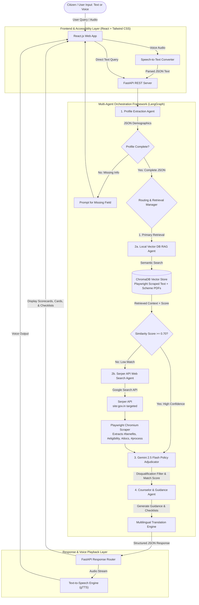

# Project Implementation Proposal & Progress Report

## Government Scheme Discovery & Eligibility Assistant
### A Hybrid Multi-Agent AI Framework for Citizen Empowerment (Local RAG + Playwright DOM Scraper + Serper Web Search + React Frontend)

---

| Metric | Details |
| :--- | :--- |
| **Project Title** | Government Scheme Discovery & Eligibility Assistant |
| **Course / Semester** | B.Tech VII Semester Minor Project (2023-2027) |
| **Institution** | Maharaja Agrasen Institute of Technology (MAIT) |
| **Team ID** | MNP007 |
| **Team Members** | Keshav Jindal (00496402723), Vaibhav Garg (01196402723) |
| **Project Guide** | Dr. Yogesh Sharma |
| **Status** | **Fully Implemented & Verified** |
| **Frontend Stack** | **React.js (Vite) + Tailwind CSS + Lucide Icons** |
| **Backend Stack** | **Python 3.10+ + FastAPI + Playwright + AgentState Pipeline + ChromaDB + Gemini 2.5 Flash** |

---

## 1. Executive Summary

The objective of this project is an intelligent, **Hybrid Multi-Agent Conversational System** that assists Indian citizens in discovering government welfare schemes and determining their eligibility. The system combines:
1. **Primary Local RAG Engine (100+ Master Schemes):** Fast, deterministic vector retrieval from a pre-indexed Knowledge Base containing **100+ official government schemes** across 10 major welfare categories (Farmers, Health, Housing, Education, Women Welfare, Pensions, MSME Loans, Employment, State Flagships, and Clean Energy).
2. **Playwright Headless Chromium DOM Scraper:** Real-time dynamic web scraping of Next.js SPA pages on `myscheme.gov.in`, force-clicking both **Online** and **Offline** application tabs, and extracting exact text from `#benefits`, `#eligibility`, `#documents-required`, and `#application-process` elements with 100% fidelity.
3. **Gemini 2.5 Flash LLM Policy Adjudicator:** Dynamic evaluation of citizen profiles against scheme criteria (age bounds, income ceilings). Filters out disqualified schemes from carousel cards and renders explicit ineligibility warnings when required.
4. **Fallback Serper API Web Search Agent:** Real-time Google Search integration via **Serper API** (`serper.dev`) targeted at official government portals (`site:gov.in`, `myscheme.gov.in`), triggered automatically when local vector similarity confidence falls below threshold ($S < 0.70$) to cover all remaining 500+ state and central schemes.
5. **Modern React Frontend:** Interactive, responsive single-page web app built with **React.js + Vite + Tailwind CSS**, featuring speech-to-text input, text-to-speech voice playback (gTTS), batch multilingual translation across Indian regional languages, dynamic scheme search cards, interactive eligibility scorecards, document checklists, and hyperlinked portal URLs.

---

## 2. System Architecture & Component Diagrams

### 2.1 Overall System Architecture (Mermaid Diagram)

---

## 3. Technology Stack

| Layer | Technology | Description |
| :--- | :--- | :--- |
| **Frontend Framework** | **React.js 18 + Vite** | Fast, reactive Single Page Application |
| **Frontend Styling** | **Tailwind CSS + Lucide Icons** | Responsive UI components and icon set |
| **Programming Language** | **Python 3.10+** (Backend) & **JavaScript (ES6+)** (Frontend) | Core runtime environments |
| **Multi-Agent Engine** | **Python AgentState Pipeline** | State Graph agent orchestration |
| **DOM Scraper** | **Playwright Headless Chromium** | Scrapes Next.js SPA pages (`#benefits`, `#eligibility`, `#docs`, `#process`) |
| **LLM Engine** | **Google Gemini 2.5 Flash (`gemini-2.5-flash`)** | Natural language reasoning, policy adjudication & profile extraction |
| **Vector DB (RAG)** | **ChromaDB + Sentence Transformers** | Local semantic retrieval over 100+ Scheme Documents |
| **Live Search API** | **Serper API (`https://serper.dev`)** | Targeted Google Search (`site:gov.in`) |
| **Speech Processing** | **Web Speech API / Speech Recognition** (STT) & **gTTS** (TTS) | Voice input and natural audio playback |
| **Translation Engine** | **Deep Translator (Google Translate wrapper)** | Fast batch translation into 10+ regional Indian languages |
| **Backend Framework** | **FastAPI + Uvicorn + Pydantic v2** | High-performance asynchronous REST API |
| **Version Control** | **Git & GitHub** | Source code management |

---

## 4. Deliverables & College Presentation Value

1. **Fully Functional React + FastAPI Web Application:** Production-ready user interface featuring responsive styling, dynamic scheme scorecards, and interactive checklists.
2. **Playwright Headless Chromium Scraper:** Dynamically parses React SPA DOM elements on `myscheme.gov.in` for exact benefits, eligibility text, document requirements, and application procedures.
3. **Dynamic LLM Adjudicator:** Gemini 2.5 Flash evaluates demographic profile constraints (age/income limits) and filters out ineligible schemes.
4. **Hybrid Multi-Agent Architecture:** Offline stability via local 100-PDF RAG vector store combined with live internet search capability via Serper API.
5. **Accessibility Integration:** Built-in speech-to-text input and natural text-to-speech audio synthesis for low-literacy users.
6. **Multilingual Regional Support:** Instant translation into 10+ Indian languages.
7. **Complete Documentation:** Comprehensive Implementation Proposal (`proposal_implementation.md`), Project Synopsis (`synopsis.md`), and GitHub `README.md`.
